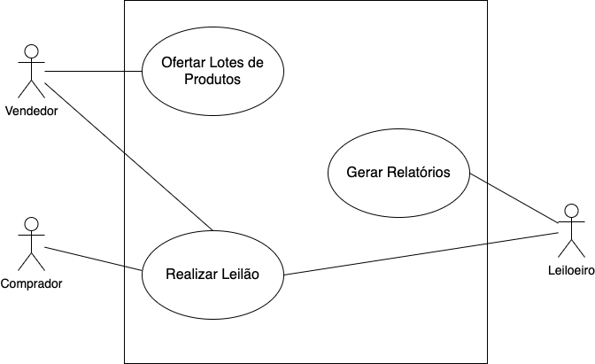

# PCS3643 - Laboratório de Engenharia de Software I

Este é o repositório do grupo 6 da turma de sexta-feira da disciplina PCS3643 - Laboratório de Engenharia de Software I, ministrada pelo Prof. Dr. Kechi Hirama. 

O grupo é composto pelos integrantes:

| Nome  | Conta GitHub | 
|:---|:---|
| Alexandre Marques Carrer  |  <a href="https://github.com/alemarquis">@AleMarquis</a> |
| Felipe Bagni              |  <a href="https://github.com/febagni">@febagni</a> |
| Rafael Yuji Yokowo        |  <a href="https://github.com/rafaelyokowo">@rafaelyokowo</a> |

Para acessar o workspace do Trello do projeto, basta clicar [aqui](https://trello.com/pcs3643g6).

---

## Aula 01 (03/09/2021)

A ideia é o desenvolvimento e a implementação de um Sistema Virtual de Leilões, cujo enunciado pode ser lido [aqui](./docs/enunciado.pdf).

O board do Workshop de Requisitos no Trello pode ser visto neste [link](https://trello.com/b/Gd9XbEmc/workshop-de-requisitos).

---

## Aula 02 (10/09/2021)

O documento com as especificações dos casos de uso pode ser lido [aqui](./docs/Especificacao_Casos_de_Uso.pdf).

E o diagrama resultante é o seguinte:

---