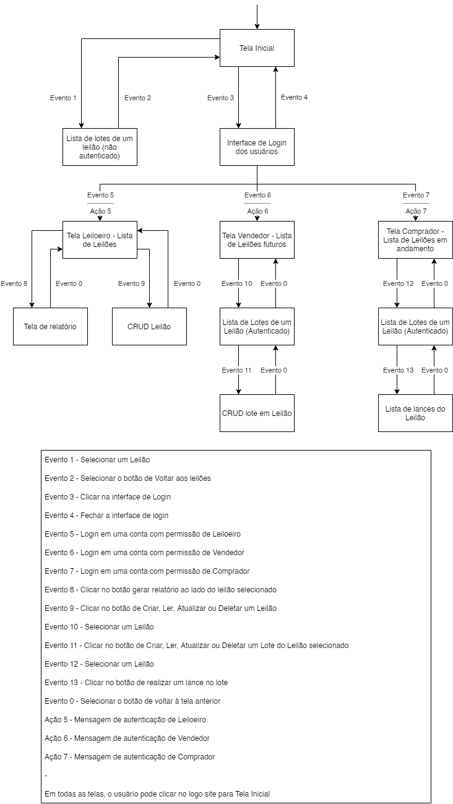

# PCS3643 - Laboratório de Engenharia de Software I

Este é o repositório do grupo 6 da turma de sexta-feira da disciplina PCS3643 - Laboratório de Engenharia de Software I, ministrada pelo Prof. Dr. Kechi Hirama. 

O grupo é composto pelos integrantes:

| Nome  | Conta GitHub | 
|:---|:---|
| Alexandre Marques Carrer  |  <a href="https://github.com/alemarquis">@AleMarquis</a> |
| Felipe Bagni              |  <a href="https://github.com/febagni">@febagni</a> |
| Rafael Yuji Yokowo        |  <a href="https://github.com/rafaelyokowo">@rafaelyokowo</a> |

Para acessar o workspace do Trello do projeto, basta clicar [aqui](https://trello.com/pcs3643g6).

---

## Aula 01 (03/09/2021)

A ideia é o desenvolvimento e a implementação de um Sistema Virtual de Leilões, cujo enunciado pode ser lido [aqui](./docs/enunciado.pdf).

O board do Workshop de Requisitos no Trello pode ser visto neste [link](https://trello.com/b/Gd9XbEmc/workshop-de-requisitos).

---

## Aula 02 (10/09/2021)

O documento com as especificações dos casos de uso pode ser lido [aqui](./docs/ERS_g6.pdf). Assim, como o diagrama.

Update (24/09/2021): o documento foi atualizado após revisão para o plano de testes.

Update (08/10/2021): o documento foi atualizado após revisão para fazer o diagrama E-R para o Banco de Dados.

---

## Aula 03 (17/09/2021)

O documento com a Especificação de Caso de Uso (marcada) e o Modelo de Análise e a versão inicial dos Diagramas de Classes, encontra-se [aqui](./docs/ERS_g6.pdf).

Update (24/09/2021): o documento foi atualizado após revisão para o plano de testes.

Update (08/10/2021): o documento foi atualizado após revisão para fazer o diagrama E-R para o Banco de Dados.

---

## Aula 04 (24/09/2021)

O documento com o Plano de Testes encontra-se [aqui](./docs/Plano_de_Testes_g6.pdf).

---

## Aula 05 (01/10/2021)

A implementação da classe Lot, que representa o lote, com CRUD está [neste diretório](./src/).

---

## Aula 06 (08/10/2021)
Foi feita a implementação da classe Lot com e sem autenticação, que representa o lote, com Banco de Dados (MySQL) e CRUD, que está [neste diretório](./src/).

O Diagrama da Entidade Relacionamento dos casos de uso são:

- Caso de Uso 1:

- Caso de Uso 2:

- Caso de Uso 3:

Os diagramas do [documento](./docs/ERS_g6.pdf) foram atualizado após revisão para fazer o diagrama E-R para o Banco de Dados.

---

## Aula 07 (15/10/2021)
Foi feita a implementação das classes Auction e Auctioneer, além melhorias em UI e UX, trabalhando-se o front-end com CSS e HTML. Desenvolvido um logo para o projeto e feito o Diagrama de Navegação (modelo de interfaces e navegação), como pode ser visto aqui:

---

## Aula 08 (22/10/2021)
Foi feita a detecção de alguns problemas na implementação das classes Auction e Auctioneer. Foram adicionados métodos nos models das classes lot e lot_user. Foram implementados testes de unidades para tais classes e feito um novo [README](./src/README.md) explicando como rodar o projeto.

---

## Aula 09 (05/11/2021)
Foi feita a implementação dos testes com o caso de uso criar lote com uso do Selenium. Foi atualizado o [README](./src/README.md) com as instruções para rodar o projeto de forma local explicando como rodar o projeto.

